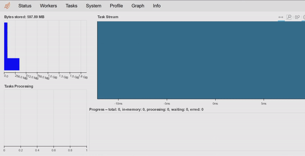
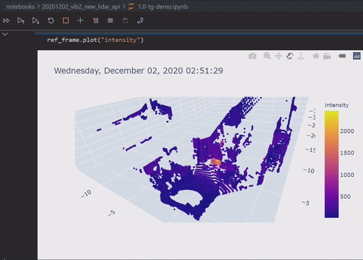

pointcloudset
=========================================

.. inclusion-marker-do-not-remove

A package to work with pointcloud datasets. A pointcloud dataset is a collection of pointclouds
recorded over a time period.

Features
################################################
* Handles pointclouds over time
* Building complex pipelines with a clean and maintainable code

.. code-block:: python

   newpointcloud = pointcloud.limit("x",-5,5).filter("quantile","reflectivity", ">",0.5)

* Apply arbitrary functions to datasets of pointclouds

.. code-block:: python

   def isolate_target(frame: PointCloud) -> PointCloud:
      return frame.limit("x",0,1).limit("y",0,1)

   def diff_to_pointcloud(pointcloud: PointCloud, to_compare: PointCloud) -> PointCloud:
      return pointcloud.diff("pointcloud", to_compare)

   result = dataset.apply(isolate_target).apply(diff_to_pointcloud, to_compare=dataset[0])

* Support for large files with lazy evaluation and parallel processing

* Support for numerical data per point (intensity, range, noise …)
* Interactive 3D visualisation

* High level processing based on dask, pandas, open3D and pyntcloud
* Docker image is available
* Optmised for automotive lidar - especially the ones by Ouster
* Directly read ROS bagfiles and many pointcloud file formats
* A commandline tool to convert ROS bagfiles

Use case examples
################################################

- Post processing and analytics of a lidar dataset recorded by ROS
- A collection of multiple lidar scans from a terrestrial laser scanner
- Comparison of mutliple pointclouds to a ground truth
- Analytics of pointclouds over time
- Developing algorithms on a single frame and then applying them to huge datasets

Installation with pip
################################################

Install python package with pip:

.. code-block:: console

   pip install pointcloudset

Installation with Docker
################################################

TODO

Quickstart
################################################

.. code-block:: python

   from pointcloudset import Dataset, PointCloud
   from pathlib import Path

   dataset = Dataset.from_file(Path(rosbag_file.bag), topic="/os1_cloud_node/points", keep_zeros=False)
   pointcloud = PointCloud.from_file(Path(lasfile.las))

* Read the html documentation.
* See the usage.ipynb notebook in the documentation folder for an interactive tutorial.
* For even more usage examples you can have a look at the tests.

Comparison to related packages
################################################

#. `ROS <http://wiki.ros.org/rosbag/Code%20API>`_ -  bagfiles can contain many pointclouds from different sensors.
   The downside of the format is that it is only suitable for serial access and not well suited for data analytics and post processing.
#. `pyntcloud <https://github.com/daavoo/pyntcloud>`_ - Only for single pointclouds. This package is used as the basis for the
   PointCloud object.
#. `open3d <https://github.com/intel-isl/Open3D>`_ - Only for single pointclouds. Excellend package, which is used for some
   methods on the PointCloud.
#. `pdal <https://github.com/PDAL/PDAL>`_ - Works also with pipelines on pointclouds but is mostly focused on single point cloud processing.
   Pountcloudset is purely in python and based on pandas dataframes. In addtion pointcloudset works in parallel to process large datasets.

Citation and contact
################################################

.. |orcid| image:: https://orcid.org/sites/default/files/images/orcid_16x16.png
   :target: https://orcid.org/0000-0002-3925-6260>

|orcid| `Thomas Gölles <https://orcid.org/0000-0002-3925-6260>`_
email: thomas.goelles@v2c2.at

ADD link to JOSS paper here and DOI