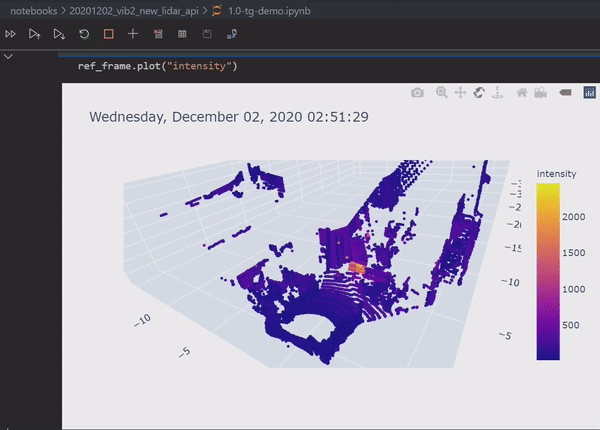

pointcloudset
=========================================

.. inclusion-marker-do-not-remove

A package to work with pointcloud datasets. A pointcloud dataset is a collection of pointclouds
recorded over a time period.

Features
########################
* Handles Pointclouds over time
* Apply arbitrary functions to datasets of pointclouds
* Support for numerical data per point (intensity, range, noise …)
* Support for large files with lazy evaluation, parallel processing
* Interactive 3D visualisation

* High level processing based on dask, pandas, open3D and pyntcloud
* HTML documented API, Interactive jupyter notebook with examples
* Docker image is available

Use case examples
#######################################
- Post processing and analytics of a lidar dataset recorded by ROS
- A collection of multiple lidar scans from a terrestrial laser scanner
- Comparison of the point cloud to a ground truth
- Analytics of point clouds over time

Installation and Quickstart
#######################################

Install python package with pip:

.. code-block:: console

   pip install pointcloudset

Quickstart
########################

.. code-block:: python

   from pointcloudset import Dataset, Frame
   from pathlib import Path

   dataset = Dataset.from_file(Path(rosbag_file.bag), topic="/os1_cloud_node/points", keep_zeros=False)
   frame = Frame.from_file(Path(lasfile.las))

* See the usage.ipynb notebook in the notebook folder for an interactive tutorial.
* For  more usage examples you can have a look at the tests.