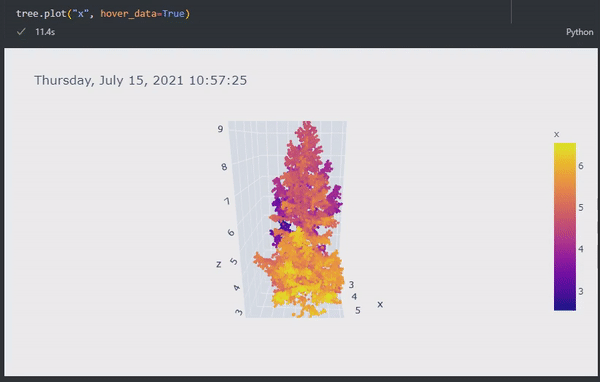

pointcloudset
=========================================

.. inclusion-marker-do-not-remove

A package to work with pointcloud datasets. A pointcloud dataset is a collection of pointclouds
recorded over a time period.

Features
################################################
* Handles Pointclouds over time
* Apply arbitrary functions to datasets of pointclouds
* Building complex pipelines with a clean and maintainable code
* Support for large files with lazy evaluation, parallel processing
* Support for numerical data per point (intensity, range, noise …)
* Interactive 3D visualisation

* High level processing based on dask, pandas, open3D and pyntcloud
* HTML documented API, Interactive jupyter notebook with examples
* Docker image is available
* Optmised for automotive lidar - especially the ones by ouster
* Load and save datasets of pointclouds
* Handling of pointcloud datasets for further processing with open3D or pyntcloud
* A commandline tool to convert ROS bagfiles

Use case examples
################################################

- Post processing and analytics of a lidar dataset recorded by ROS
- A collection of multiple lidar scans from a terrestrial laser scanner
- Comparison of the point cloud to a ground truth
- Analytics of point clouds over time
- Developing Algorithms on a singel frame and then applying them to huge datasets
- Comparision to multiple

Installation with pip
################################################

Install python package with pip:

.. code-block:: console

   pip install pointcloudset

Installation with Docker
################################################

TODO

Quickstart
################################################

.. code-block:: python

   from pointcloudset import Dataset, Frame
   from pathlib import Path

   dataset = Dataset.from_file(Path(rosbag_file.bag), topic="/os1_cloud_node/points", keep_zeros=False)
   frame = Frame.from_file(Path(lasfile.las))

* See the usage.ipynb notebook in the notebook folder for an interactive tutorial.
* For  more usage examples you can have a look at the tests.

Comparison to related packages
################################################

#. `ROS <http://wiki.ros.org/rosbag/Code%20API>`_ - ROS bagfiles can contain many pointclouds from different sensors.
   The downside of the format is that it is only suitable for seriel access

#. `pyntcloud <https://github.com/daavoo/pyntcloud>`_ - Only for single pointclouds. This package is used as the basis for the
   PointCloud object.

#. `open3d <https://github.com/intel-isl/Open3D>`_ - Only for single pointclouds. Excellend package, which is used for some
   methods on the PointCloud.

Citation
################################################

ADD link to JOSS paper here and DOI