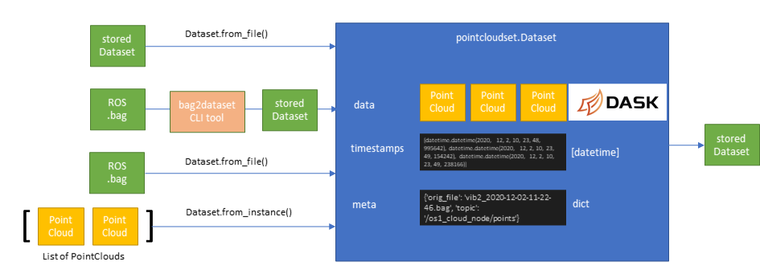
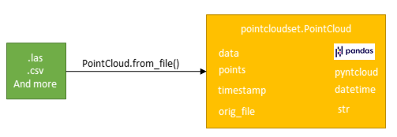

How to read the API documentation
========================================

A Dataset consists of multiple PointCloud objects which form the two main classes of the package.

The main classes
----------------------------------------

**Dataset**: :class:`pointcloudset.dataset.Dataset` based on :class:`pointcloudset.dataset_core.DatasetCore`

**PointCloud**: :class:`pointcloudset.pointcloud.PointCloud` based on :class:`pointcloudset.pointcloud_core.PointCloudCore`

Modules
----------------------------------------

As a common user these Classes are enough to tackle most proplems. If you want to dive deeper or contribute to
the package than you should have a look at the other modules.

 Datasets and PointCloud use the functions of the following modules:
    * :mod:`pointcloudset.diff`
    * :mod:`pointcloudset.filter`
    * :mod:`pointcloudset.geometry`
    * :mod:`pointcloudset.io`
    * :mod:`pointcloudset.plot`

For a more detailed documentation see the section below.