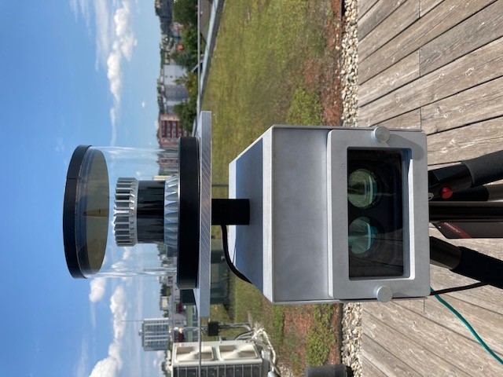

Welcome to pointcloudset's documentation!
=========================================

.. include:: ../../../README.rst
   :start-after: inclusion-marker-do-not-remove

.. toctree::
   :maxdepth: 1
   :caption: Convert ROS bagfiles

   commandline_interface

.. toctree::
   :maxdepth: 1
   :caption: Contribute

   how_to_contribute
   getting_started_contribution
   guidelines

.. toctree::
   :maxdepth: 1
   :caption: Tutorial

   tutorial_notebooks/usage
   tutorial_notebooks/reading_las

.. toctree::
   :maxdepth: 5
   :titlesonly:
   :caption: Python API

   description_python_api
   python-api/pointcloudset

Indices and tables
==================

* :ref:`genindex`
* :ref:`modindex`
* :ref:`search`
